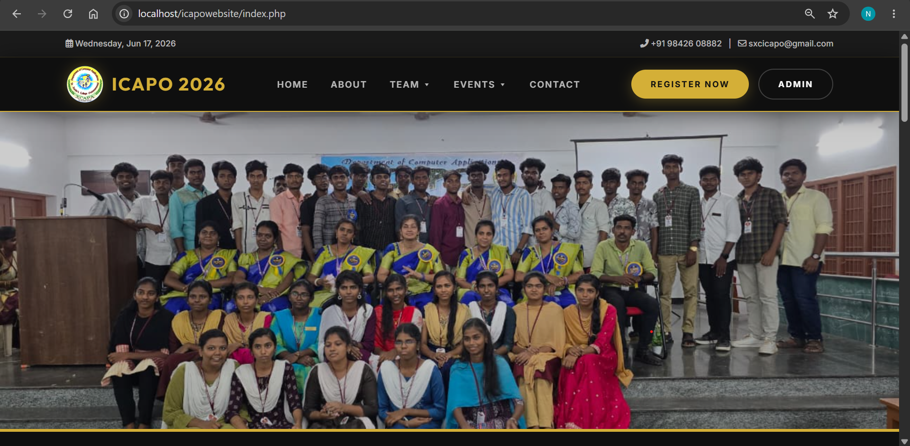
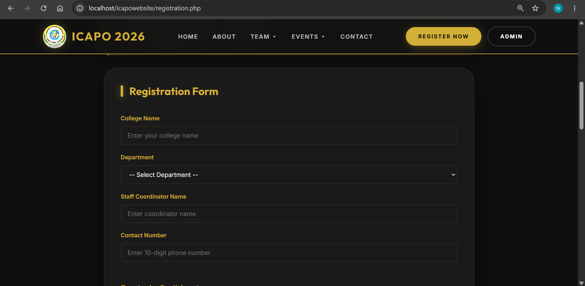
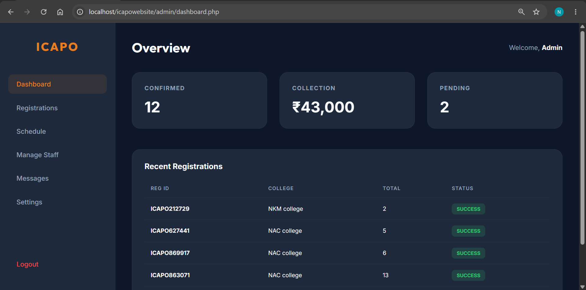

# College Event Management System

## Overview
College Event Management System is a web-based application developed using PHP, MySQL, HTML, CSS, and JavaScript. The system enables efficient management of college events, participant registrations, event details, and administrative operations.

## Features
- User Registration and Login
- Event Creation and Management
- Participant Registration
- Event Details Viewing
- Admin Dashboard
- Responsive User Interface
- Secure Database Management

## Technologies Used
- PHP
- MySQL
- HTML5
- CSS3
- JavaScript
- Bootstrap

## System Modules
### User Module
- View Events
- Register for Events
- Manage Profile

### Admin Module
- Add Events
- Edit Events
- Delete Events
- Manage Participants
- View Reports

## Project Structure
## Screenshots

### Home Page

### Event Registration

### Admin Dashboard

## Installation Guide

1. Download the project.
2. Copy the project folder into XAMPP htdocs.
3. Import the database.sql file into MySQL.
4. Start Apache and MySQL.
5. Open the project in your browser.

## Future Enhancements
- Email Notifications
- QR Code Based Event Entry
- Online Payment Integration
- Certificate Generation
- Event Analytics Dashboard

## Author
N. Narthani

## Academic Information
Developed as an BCA Mini Project for learning Web Application Development using PHP and MySQL.
